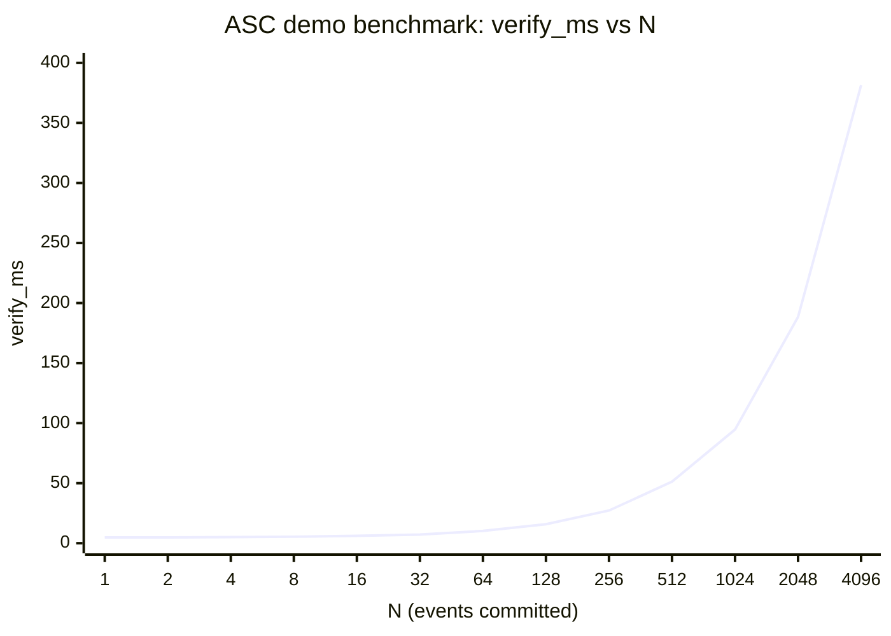

# Audit-Backed White Paper Update for NESSA qFold-EC and ASC Privacy-Preserving Ad Verification

## Executive summary

This work updates the provided qFold-EC white paper baseline (sha256 `8700a01b0d5cb2965b7ae782ec09ff144e78a6c5450d6b48d140cc92dff603fa`) using the metadata bundle in `docs.zip` (sha256 `2f6cbd688058887193718bca3374b6b7898e4020e19bc476381c8c653d7fca8f`) as the authoritative internal audit source. The update reframes the document from an issue-resolution ledger into a complete, deployment-oriented white paper for privacy-preserving ad eligibility and verification (“ASC ad demo”), while preserving the implementability focus and the strict transcript/encoding requirements.

Key audit-backed facts incorporated into the updated white paper:

- **Protocol verification status (internal audit):** `verification_report.json` reports **80 total checks, 80 passed, 0 failed** (file `docs/generated/protocol/verification/verification_report.json`, sha256 `e873fab3ad50d1801e37ba310d87af780552bcc09d6648eee72197d3c471aa58`).
- **Computed test vectors (internal audit):** `test_vectors_output.json` includes `TV-LIN-8` with `proof_size_bytes = 832` and `TV-R1CS-8` with `proof_size_bytes = 1120` (file `docs/generated/protocol/test_vectors/test_vectors_output.json`, sha256 `400dfb6f6176e95f4d078ba2f2ad4b1615fc403dbb298866eb92d1148aecdb63`).
- **ASC ad demo outcomes (internal audit):** `asc_ad_business_summary.json` reports **100 total checks**, **94 accepted**, **6 rejected** with **0 unexpected rejections** and denial reasons dominated by `age_band_below_minimum` and `consent_mask_missing` (file `docs/generated/asc_ad_demo/audit/asc_ad_business_summary.json`, sha256 `a11954c03d016ab480aa7ab999a1aacbfb2a260e6e52b76a0cfb4f759feb6f1b`).
- **ASC benchmark scaling (internal audit):** `asc_ad_benchmark_rows.json` shows `verify_ms` rising from **~4.808 ms at N=1** to **~381.371 ms at N=4096**, while benchmark `proof_size_bytes` stays constant at **1632** in that profile (files `docs/generated/asc_ad_demo/audit/asc_ad_benchmark_rows.json`, sha256 `b7d462fb594e065c3176c8d2d41832c904dd8767aefaac7f0fa93d3881566df9` and `docs/generated/asc_ad_demo/audit/asc_ad_benchmark_validity.json`, sha256 `8bec0abe663a1101a0b65202df0436d8c28df6f009bf26e37e4dba13c6a595bc`).
- **Privacy logging posture (internal audit):** `asc_ad_privacy_audit.json` indicates proofs are redacted and fields like `prover_identity`, `raw_profile`, and `user_secret_digest` are excluded from audit outputs (file `docs/generated/asc_ad_demo/audit/asc_ad_privacy_audit.json`, sha256 `0e5dd4b9bc5566f6c9ab9e6ed933ac1481ce34efbf5216828c93143cf2a46dca`).

External standards and developments were researched and mapped into the updated white paper, prioritizing primary and official sources: RFC 8949 (CBOR deterministic encoding), RFC 9380 (hashing to curves), RFC 9496 (ristretto255), RFC 8235 (Schnorr NIZK), FIPS 180-4 (SHA-512), Nova, HyperNova, Bulletproofs, GDPR Article 25 plus EDPB guidance, DSA Article 28, IAB GPP, and the W3C Private Advertising Technology Working Group charter.

## Source corpus and methodology

**Corpus included in the audit comparison**

The update used two authoritative local inputs:
- Baseline white paper: original audit-session input `/mnt/data/latest-whitepaper.md` (not tracked in this repository), sha256 `8700a01b0d5cb2965b7ae782ec09ff144e78a6c5450d6b48d140cc92dff603fa`
- Internal audit bundle: repository-root `docs.zip` (sha256 `2f6cbd688058887193718bca3374b6b7898e4020e19bc476381c8c653d7fca8f`)

The internal audit bundle contains (among others) protocol verification reports, protocol test vectors, ASC demo artifacts (business summary, privacy audit, benchmark rows/validity), and use-case flow summaries. These were treated as authoritative for “what is implemented and measured,” and are referenced by file name and SHA-256 throughout.

**How the “line-by-line where relevant” comparison was performed**

The comparison methodology emphasized *traceable, claim-to-evidence mapping*:

  - The baseline white paper was scanned for normative parameterization and schema claims that should be verifiable against metadata (suite identifiers, hash/group choices, DST labels, tags schema, proof object fields, and performance assertions).
  - The metadata bundle was parsed as structured evidence:
    - `docs_bundle_manifest.json` was used to enumerate artifact filenames and the demo’s deterministic/benchmark flags.
    - `verification_report.json` was used to anchor suite parameters and DST strings.
    - `test_vectors_output.json` was used to anchor computed proof sizes in the reference vectors.
    - `asc_ad_test_metadata.json`, `asc_ad_business_summary.json`, `asc_ad_privacy_audit.json`, `asc_ad_benchmark_rows.json`, and `asc_ad_benchmark_validity.json` were used to anchor the ASC demo story (encoding id, attribute fields, outcomes, privacy posture, and scaling).
    - The ASC focused proof records (`docs/generated/asc_ad_demo/audit/asc_ad_focused_proofs.json`) were spot-checked to validate inferred relationships (for example, that `policy_hash` equals SHA-512 of `policy_compiled` bytes in the demo’s tag set for accepted cases).
  - Each identified discrepancy was converted into an explicit edit in the updated white paper and recorded in a change log mapping metadata item → revision.

  **Connector-first scan**

## Gap analysis and inconsistencies

The table below lists the highest-impact gaps and inconsistencies between (a) the baseline white paper and (b) the audit bundle as implemented/measured. It also records the concrete action taken in the updated white paper.

| Baseline white paper claim or assumption | Audit finding (authoritative metadata) | Action taken in update |
|---|---|---|
| Tags schema examples suggest some application identifiers are integers (e.g., `encoding_id`, `policy_id` shown as small ints in example tags). | In ASC demo proof bundles, `encoding_id` is the text string `"nessa_asc_ad_v1"` and `policy_id` is a text string policy name (e.g., `"nessa_asc_ad_luxury_targeting_checksum_v1:ctx:<digest>"`) inside the tags map for accepted cases (file `docs/generated/asc_ad_demo/audit/asc_ad_focused_proofs.json`, sha256 `466e6bf5aaac69964f897fb6f126e4cd57f9914ef3b80b8eaf7438f9c443e88b`). | Updated the tags section to be **profile-typed**: integer keys remain, but values may be int/bstr/tstr; ASC profile defines `encoding_id` and `policy_id` as text strings. |
| Performance/proof-size statements are not anchored to measured results. | ASC benchmark shows **proof_size_bytes constant at 1632** across N in that profile and `verify_ms` increasing to ~381 ms at N=4096 (files `asc_ad_benchmark_rows.json` sha256 `b7d462...` and `asc_ad_benchmark_validity.json` sha256 `8bec0a...`). | Added an explicit benchmark section with a verify_ms-vs-N chart and table; removed any “near-constant verify time” tone for this profile. |
| Privacy posture and logging requirements are not described as an operational control. | Privacy audit indicates proofs are redacted and fields like `prover_identity`, `raw_profile`, `user_secret_digest` are redacted (file `asc_ad_privacy_audit.json`, sha256 `0e5dd4...`). | Added a dedicated privacy-safe logging posture and clarified the guarantee boundary between proof verification and observability controls. |
| The document is protocol-centric and does not present a complete ad verification system architecture. | ASC demo provides business summary outcomes and a defined encoding id and attribute schema for ad verification use case (file `asc_ad_test_metadata.json` sha256 `b3f933...`; `asc_ad_business_summary.json` sha256 `a11954...`). | Reframed as a system white paper with an ASC ad verification “application profile,” plus an architecture diagram and control surface description (consent, nullifiers, audit). |
| Proof object format assumptions are not reconciled with the demo’s richer record structure. | Demo proof objects include explicit `pi_link` and `pi_cons_linear` fields (with stored challenge fields in the demo records) and omit proof objects entirely for denied cases (some denied entries have `row_count=0` and no folded object). | Clarified normative vs demo format: verifier MUST recompute challenges; including them in records is optional convenience and must be checked for consistency. Also documented deny-path behavior. |
| Use-case “flows” are not used to clarify what is and is not proved. | `flow_summaries.json` marks multiple flows as “Mechanics demo only” and explicitly states application semantics must be enforced externally (file `docs/generated/usecase_flows/metadata/flow_summaries.json`, sha256 `d99d17...`). | Elevated the “guarantee boundary” and added roadmap items for turning mechanics demos into full semantics. |
| External compliance mapping is missing or incomplete for ad-tech context. | Applicable high-signal standards and regulations exist: RFC 8949 (CBOR deterministic encoding); RFC 9380 (hash-to-curve); RFC 9496 (ristretto255); RFC 8235 (Schnorr NIZK); GDPR Article 25 plus EDPB guidance; DSA Article 28; IAB GPP; and the W3C PAT Working Group charter. | Added a compliance/standards mapping section and “standards-aligned design decisions” narrative with primary citations. |

## External research and standards alignment

This section summarizes the most important external standards and recent developments that were integrated into the updated white paper.

**Deterministic serialization and transcript safety**

CBOR is standardized in RFC 8949, which includes explicit deterministic encoding requirements and emphasizes that protocols must be explicit about deterministic choices to avoid divergence.
This matters directly for any Fiat–Shamir style challenge derivation because transcript ambiguity undermines verifier reproducibility and can introduce security and interoperability failure modes.

**Cryptographic suites for prime-order groups and hashing to group/field**

RFC 9380 (“Hashing to Elliptic Curves”) specifies hash-to-curve and hash-to-field algorithms and domain separation guidance; it is published on the IRTF stream as Informational, but widely used as the shared algorithm definition reference.
RFC 9496 specifies the ristretto255 and decaf448 prime-order groups, enabling protocols to avoid cofactor pitfalls by operating in a prime-order abstraction.

**Schnorr NIZK framing**

RFC 8235 provides a concrete specification for Schnorr non-interactive zero-knowledge proofs (Informational, Independent stream), including the importance of fixed formatting and boundaries for hashed context.

**Hash standard and security controls**

SHA-512 is within the Secure Hash Standard (FIPS 180-4). The NIST CSRC publication page for FIPS 180-4 documents SHA family usage and provides the canonical reference point.
For organizational security and privacy controls and governance mapping, NIST SP 800-53 Rev. 5 (including updates) provides a consolidated catalog of security and privacy controls and is relevant for verifier gateway operations and audit/control posture.
For privacy risk management framing (especially in enterprise adoption conversations), the NIST Privacy Framework (v1.0, Jan 2020) is a useful voluntary risk-management scaffold.

**Privacy and advertising regulatory drivers**

- GDPR Article 25 mandates data protection by design and by default, and the EDPB provides GDPR Article 25 guidelines clarifying expectations and interpretation.
- The EU DSA Article 28 prohibits advertising on online platform interfaces “based on profiling” when the platform is aware with reasonable certainty that the recipient is a minor, and it specifies that compliance must not force additional personal data processing solely to assess minor status.
- In ad-tech signaling standards, IAB Tech Lab’s GPP is designed to streamline transmission of privacy, consent, and choice signals across jurisdictions and channels and is explicitly positioned as a way to adapt to evolving privacy regulations.

**Industry standards trajectory for privacy-preserving ad measurement**

W3C’s Private Advertising Technology Working Group charter (start date 12 Nov 2024) frames the mission to specify web features and APIs that support advertising while providing strong privacy assurances predominantly through technical means.
This provides a standards-direction backdrop for why privacy-preserving verification primitives (including proof-based eligibility and aggregation) are increasingly relevant.

**Market context**

IAB’s 2025 release about the “Internet Advertising Revenue Report: Full Year 2024” reports US internet advertising revenue at **USD 258.6B in 2024**, indicating the size of the ecosystem where compliance and verification improvements can produce material economic impact.

## Updated white paper and supporting artifacts

### Repository-local supporting materials

- `docs.zip` — audit bundle used throughout this report (sha256 `2f6cbd688058887193718bca3374b6b7898e4020e19bc476381c8c653d7fca8f`)
- `docs/generated/` — generated protocol, ASC, and use-case artifacts referenced throughout this report
- `../latest-whitepaper.md` — current top-level whitepaper draft in this repository (sha256 `0b8b40161a36fd19ee657919c06de018dbcbe0ee09118b5043ed86e4c4c2204b`)

### Mermaid architecture diagram

```mermaid
flowchart LR
  subgraph Prover["Prover (client / publisher-side agent)"]
    E[1. Collect ad events / features] --> ENC[2. Encode to fixed-width vectors]
    ENC --> COM[3. Commit to each event vector]
    COM --> FOLD[4. Fold commitments + witnesses]
    FOLD --> PROVE[5. Generate qFold-EC proof π]
    PROVE --> OBJ[6. Proof bundle (folded object + tags + commitments)]
  end

  subgraph Verifier["Verifier gateway (campaign enforcement)"]
    OBJ --> PARSE[7. Parse + validate encoding + strict rejects]
    PARSE --> VFY[8. Verify transcript binding + π_link + π_cons]
    VFY --> DECIDE[9. Accept / reject with reason codes]
    DECIDE --> AUDIT[10. Store privacy-safe audit output]
  end

  subgraph ExternalControls["External controls (required)"]
    GPP[Consent / preference signals (e.g., GPP)] --> ENC
    REPLAY[Nullifier registry / replay checks] --> DECIDE
    CONTEXT[Request-context recomputation] --> PARSE
  end
```

### Mermaid performance scaling chart: verify_ms vs N

(From internal audit benchmark rows, ASC demo profile; file `docs/generated/asc_ad_demo/audit/asc_ad_benchmark_rows.json`, sha256 `b7d462fb594e065c3176c8d2d41832c904dd8767aefaac7f0fa93d3881566df9`.)



### Deliverable: table comparing original vs updated sections

| Baseline white paper section(s) | Updated white paper section(s) | What changed |
|---|---|---|
| “Rewrite Summary” and “Issue Resolution Ledger” | Executive summary; problem statement; background/context; technical approach; implementation details; benefits/ROI; market analysis; risks; compliance; roadmap | Baseline is primarily a protocol memo plus issue ledger. Update turns it into a full white paper while preserving implementability and audit traceability. |
| “Wire format” and verifier steps | Implementation details; architecture; standards mapping | Kept strict deterministic encoding narrative and expanded it into system architecture and operational controls. |
| “Security considerations” | Risks/limitations; compliance/standards mapping | Expanded into regulatory/compliance and operational governance surface (DSA/GDPR, GPP, PAT direction). |
| Appendices (test vectors) | Appendices (audit corpus, test vector summary, benchmark charts, change log) | Replaced placeholder references and added audit-backed benchmark and demo outcomes sections. |

### Deliverable: gap analysis table

| Original white paper claim | Metadata audit finding | Action |
|---|---|---|
| Tags examples imply certain application identifiers are integers | ASC demo tags store `encoding_id` and `policy_id` as strings in accepted-case proof bundles (file `docs/generated/asc_ad_demo/audit/asc_ad_focused_proofs.json`, sha256 `466e6bf5aaac69964f897fb6f126e4cd57f9914ef3b80b8eaf7438f9c443e88b`) | Updated tags schema guidance to be profile-typed: int keys, values can be text strings for application identifiers. |
| Performance claims not grounded | Audit benchmark quantifies `verify_ms` scaling and constant benchmark proof size 1632 bytes (files `asc_ad_benchmark_rows.json` sha256 `b7d462...` and `asc_ad_benchmark_validity.json` sha256 `8bec0a...`) | Added verifiable chart/table and removed “near-constant verification” tone for this profile. |
| Privacy logging assumptions unspoken | Privacy audit explicitly redacts proof records and sensitive fields (file `asc_ad_privacy_audit.json`, sha256 `0e5dd4...`) | Added privacy-safe logging and “guarantee boundary” section; made redaction policy explicit. |
| No ad-tech consent/standards mapping | IAB GPP exists for consent signal transport, and the W3C PAT Working Group provides a standards trajectory for privacy-preserving ad tech. | Added compliance/standards mapping and integration points for consent and measurement direction. |
| No explicit regulatory drivers | DSA Article 28 restricts profiling-based ads to minors, while GDPR Article 25 requires privacy by design. | Added regulatory context and mapped design goals to these obligations. |

### Deliverable: concise change log table mapping metadata items to revisions

This is the concise, “changes-that-matter” mapping. The updated white paper also contains a longer change log appendix.

| Metadata file (sha256) | Key path | Value | Revision made |
|---|---|---|---|
| `docs/generated/docs_bundle_manifest.json` (sha256 `a1d6cdd0cf45b3944e812d35ba3e13e7203cbf5635880e1f3dcc8745d5e60a86`) | `$.deterministic` | `true` | Added reproducibility posture and treated artifacts as deterministically generated. |
| same | `$.benchmark_enabled` | `true` | Added benchmark section and made benchmark assumptions explicit. |
| `docs/generated/protocol/verification/verification_report.json` (sha256 `e873fab3ad50d1801e37ba310d87af780552bcc09d6648eee72197d3c471aa58`) | `$.summary` | `passed=80, failed=0` | Added protocol conformance headline and audit traceability. |
| same | `$.sections.A.items[label=protocol_version].value` | `NESSA-EC-RISTRETTO255-SHA512-v1` | Pinned suite id and aligned standards references (ristretto255, SHA-512, hash-to-curve). |
| same | `$.sections.A.items[label=DST_ALPHA..DST_CONS]` | `NESSA-EC:v1:*` | Made DST registry explicit and consistent across document. |
| `docs/generated/protocol/test_vectors/test_vectors_output.json` (sha256 `400dfb6f6176e95f4d078ba2f2ad4b1615fc403dbb298866eb92d1148aecdb63`) | `$.TV-LIN-8.verification.proof_size_bytes` | `832` | Replaced qualitative proof-size statements with computed vector sizes. |
| same | `$.TV-R1CS-8.verification.proof_size_bytes` | `1120` | Labeled non-linear folding example as demonstrative, not normative for v1 policy profile. |
| `docs/generated/asc_ad_demo/audit/asc_ad_test_metadata.json` (sha256 `b3f933b04a85c80ed075f6f2ca718257b17c92fa6ff6e6349a7ab1e59e0e3272`) | `$.encoding_id` | `nessa_asc_ad_v1` | Corrected tags/profile language to treat encoding ids as strings. |
| same | `$.attribute_fields` | list of 8 fields | Added explicit ad eligibility encoding schema narrative (fixed order, consistent semantics). |
| `docs/generated/asc_ad_demo/audit/asc_ad_business_summary.json` (sha256 `a11954c03d016ab480aa7ab999a1aacbfb2a260e6e52b76a0cfb4f759feb6f1b`) | `$.acceptance_rate` | `0.94` | Added outcomes section with acceptance/rejection and denial taxonomy. |
| `docs/generated/asc_ad_demo/audit/asc_ad_privacy_audit.json` (sha256 `0e5dd4b9bc5566f6c9ab9e6ed933ac1481ce34efbf5216828c93143cf2a46dca`) | `$.redacted_fields` | includes `prover_identity`, `raw_profile`, `user_secret_digest` | Added privacy-safe audit logging requirements and prohibited-field list. |
| `docs/generated/asc_ad_demo/audit/asc_ad_benchmark_rows.json` (sha256 `b7d462fb594e065c3176c8d2d41832c904dd8767aefaac7f0fa93d3881566df9`) | `$[N==4096].verify_ms` | `381.370828` | Added verify_ms vs N scaling chart and capacity-planning guidance. |
| `docs/generated/usecase_flows/metadata/flow_summaries.json` (sha256 `d99d1746a4777ce7d79e2c576203c70773da51b053c2dfd6b4649a06801d0d88`) | `$[flow_key=="login"].template_status` | “Mechanics demo only …” | Added explicit guarantee boundary and roadmap for semantics completion. |

### Deliverable: recommended sources list

The updated white paper prioritizes these primary, official, and research sources:

- **RFC 8949 (CBOR)** for deterministic encoding rules and protocol serialization guidance.
- **RFC 9380 (Hashing to Elliptic Curves)** for hash-to-field and hash-to-group guidance plus domain separation guidance.
- **RFC 9496 (ristretto255/decaf448)** for prime-order group abstraction details suitable for higher-level protocols.
- **RFC 8235 (Schnorr NIZK)** for a reference specification of Schnorr NIZK and context-formatting considerations.
- **NIST FIPS 180-4** for SHA-512 and the Secure Hash Standard reference point.
- **Nova (IACR ePrint 2021/370)** for folding-scheme framing and IVC or recursive-argument context.
- **HyperNova (IACR ePrint 2023/573)** for more recent folding-scheme-based recursive-argument developments.
- **Bulletproofs (IACR ePrint 2017/1066)** as a foundational discrete-log ZK proof reference for circuits and aggregation.
- **GDPR Article 25 (EUR-Lex)** and **EDPB Guidelines 4/2019** for privacy-by-design requirements and interpretation.
- **DSA Article 28 (EUR-Lex)** for minors profiling-based advertising restrictions.
- **IAB Tech Lab GPP** for consent and preference signal transport across the ad supply chain.
- **W3C Private Advertising Technology Working Group charter** for standards trajectory in privacy-preserving ad measurement APIs.
- **IAB/PwC Full Year 2024 Internet Ad Revenue Report** for market-size context.

## Repository-local availability and packaging

This repository snapshot preserves the audit report and supporting materials directly in checked-in form:

- `docs.zip` — original audit bundle captured for this report (sha256 `2f6cbd688058887193718bca3374b6b7898e4020e19bc476381c8c653d7fca8f`)
- `docs/generated/` — extracted and generated artifacts referenced throughout this report
- `../latest-whitepaper.md` — current top-level whitepaper draft in this repository (sha256 `0b8b40161a36fd19ee657919c06de018dbcbe0ee09118b5043ed86e4c4c2204b`)
